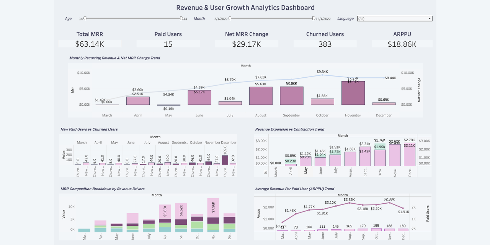

# 🎮 Subscription Revenue Growth Analysis

This project analyzes subscription-based gaming revenue and user behavior using SQL and Tableau.

The main goal of the project is to understand not only how revenue changes over time, but also what drives that growth and which risks may threaten long-term sustainability.

---

# 🎯 Project Objective

- Analyze Monthly Recurring Revenue (MRR) trends
- Identify growth drivers behind revenue increase
- Detect churn behavior and retention risks
- Measure expansion and contraction revenue
- Build an interactive business intelligence dashboard

---

# ⚙️ Tools & Technologies

- PostgreSQL / SQL
- Tableau
- GitHub
- Loom

---

# 🔍 Metrics Analyzed

- Monthly Recurring Revenue (MRR)
- Net MRR Change
- Paid Users
- New Paid Users
- New MRR
- Churned Users
- Expansion MRR
- Contraction MRR
- ARPPU (Average Revenue Per Paid User)

---

# 📊 Dashboard Preview

---

# 🔗 Interactive Tableau Dashboard

👉 https://public.tableau.com/views/RevenueGrowthUserBehaviorDashboard/RevenueUserGrowthAnalyticsDashboard?:language=en-US&:sid=&:redirect=auth&:display_count=n&:origin=viz_share_link 

---

# 🎥 Project Walkthrough

A complete walkthrough of the project including:
- SQL logic
- Revenue modeling
- Dashboard structure
- Key business insights
- Final recommendations

👉 https://www.loom.com/share/7fd703aadc5345f9bbae173740b2f7ca 

---

# 🧾 SQL Process

The SQL workflow includes:
- Monthly revenue aggregation
- User lifecycle tracking
- Revenue trend analysis
- Churn detection
- Expansion & contraction calculations

Window functions used:
- `LAG()`
- `LEAD()`

👉 [View SQL Query](sql/revenue_analysis.sql)
---

# 📈 Key Metrics

- ~63K Total MRR
- ~29K Net MRR Change
- Strong Expansion Revenue Growth
- Increasing Churn Trend

---

# 💡 Key Insights

- Revenue showed strong growth throughout the year
- Most growth came from existing users increasing their spending
- New user revenue weakened over time
- Churn increased significantly toward the end of the year
- Revenue growth alone did not necessarily indicate healthy business growth

---

# 🚀 Recommendations

- Improve retention strategies to reduce churn
- Focus on sustainable user acquisition
- Analyze churn behavior by user segment
- Monitor dependency on expansion-driven growth

---
